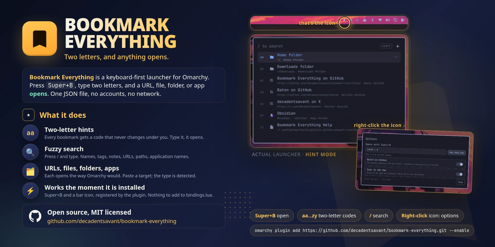

# Bookmark Everything

**Two letters, and anything opens.**

A keyboard-first launcher for [Omarchy](https://omarchy.org). Bookmark the
URLs, files, folders, and apps you reach for every day, then open any of them
with a two-letter code. No mouse, no menus, no arrow keys.



## Install

```bash
omarchy plugin add https://github.com/decadentsavant/bookmark-everything.git --enable
```

Press **Super+B**. That's it. No config to edit, no keybinding to add: the
plugin registers the key itself and puts a bookmark icon in your bar.

Prefer the launcher? Press `Super` + `Space`, search for **Add Plugin**, and
paste `https://github.com/decadentsavant/bookmark-everything`.

## Why

Your browser bookmarks only open web pages. The app menu only launches apps.
The file manager only knows files. The things you open twenty times a day
are scattered across all three, and every one of them wants you to type a
name, scan a list, and click.

Bookmark Everything puts them in one place and gives each a code your hands
learn in a day. `aa` is your project folder. `gh` is GitHub. `no` is Obsidian.
Codes never change under you, so muscle memory does the work and the launcher
is closed before you've finished thinking about it.

## How it feels

- **Super+B, `a`, `a`.** The bookmark opens. Two letters, no Enter.
- **Forgot the code?** Press `/` and type a few letters. Search covers names,
  tags, notes, URLs, paths, and app names, and is instant with a thousand
  entries.
- **Adding is a paste.** Press `+`, paste a URL or a path, done. The type is
  detected. Paths complete with Tab, like a shell, and a Places picker offers
  the folders and files you already use.
- **Apps by the dozen.** Press `Ctrl+A`, tick the ones you want, or all of
  them.
- **Looks like it belongs.** The launcher uses Omarchy's own theme, fonts, and
  colours, so it matches whatever theme you run.

## It just works

- **The hotkey is yours on install.** `Super+B` unless something already uses
  it; then the first free key from a short list, and one notification telling
  you which. Hover the bar icon any time to see it.
- **Never lost.** The bookmark icon in the bar opens the launcher with a click
  and its Options with a right-click. Don't want the icon? Hide it from
  Options and the hotkey keeps working.
- **Private by construction.** One JSON file on your machine. No accounts, no
  cloud, no network access. Edit the file by hand if you like; the launcher
  reloads it.
- **Leaves no mess.** Nothing under `~/.config/hypr` is written, ever. Disable
  or remove the plugin and the hotkey is gone with it.

## Remove

```bash
omarchy plugin remove io.github.decadentsavant.bookmark-everything
```

Your bookmarks are kept on purpose. To remove everything:

```bash
rm ~/.config/omarchy/bookmark-everything.json ~/.config/omarchy/bookmark-everything.json.bak-*
rm ~/.config/omarchy/bookmark-everything.settings.json   # exists only if you changed an option
```

---

## Reference

Everything below is for when you want more than the defaults.

<details>
<summary><b>Keys</b></summary>

| Key | Hint mode |
|-----|-----------|
| `a`…`z` twice | Open the bookmark with that code |
| `/` or Tab | Switch to Search mode |
| ↑ ↓ then Enter | Move the highlight and open it |
| `+` or Ctrl+N | Add a bookmark |
| Ctrl+V | Add the URL or path on the clipboard |
| Ctrl+A | Add installed applications in bulk |
| Ctrl+E | Edit the highlighted bookmark |
| Delete, Backspace, or Ctrl+D | Delete the highlighted bookmark, with confirmation (Backspace: Hint mode only) |
| Ctrl+I / Ctrl+O | Import / export |
| Ctrl+K or the gear at the bottom | Options: the hotkey and the bar icon |
| `zz` or `?` | Open the built-in help |
| Esc | Clear a half-typed code, then close |

In Search mode the letters go into the search box and Esc clears it, then
returns to Hint mode. The other shortcuts work in both modes. With the mouse:
click a row to open it, right-click or use the `⋯` on the highlighted row for
Open / Edit / Delete, and use the `+` in the header to add.

</details>

<details>
<summary><b>Hotkey</b></summary>

The plugin registers its key in the running compositor with `hyprctl eval`,
the same call Omarchy's own Lua config uses. It is put back after
`hyprctl reload` and unregistered when the plugin is disabled or removed.

- **Preferred key:** `Super+B`. If taken, the first free one of `Super+Alt+B`,
  `Super+Ctrl+Alt+B`, `Super+Alt+M`, `Super+Alt+U`, `Super+Alt+/`.
- **See it:** hover the bar icon. `Super+K` (Omarchy's keybindings menu) lists
  it as "Bookmark Everything".
- **Change it:** right-click the bar icon, or the gear in the launcher. Type a
  combination such as `SUPER + ALT + B` and press Enter. A key something else
  uses is refused, with the reason. Keys are typed rather than captured
  because Hyprland acts on a bound combination before the launcher could see
  it.
- **Turn it off:** the *Built-in hotkey* toggle. The screen then shows the
  exact line to add to `~/.config/hypr/bindings.lua`:

  ```lua
  o.bind("SUPER + B", "Bookmarks", "omarchy-shell shell toggle io.github.decadentsavant.bookmark-everything")
  ```

  A binding of your own is detected too: if `Super+B` is already bound when
  the plugin loads, it is left alone rather than doubled.
- **Take over a key in use:** free it first in `bindings.lua`, e.g.
  `hl.unbind("SUPER + B")`, then choose it.

Your choice lives in `~/.config/omarchy/bookmark-everything.settings.json`
(`hotkey`, `enabled`), created the first time you change something.

</details>

<details>
<summary><b>Settings and storage</b></summary>

Bookmarks live in `~/.config/omarchy/bookmark-everything.json`, a JSON array
you can edit by hand. Missing ids or hint codes are filled in on reload.

```json
{
  "id": "arch-wiki",
  "hint": "aa",
  "type": "url",
  "name": "Arch Wiki",
  "target": "https://wiki.archlinux.org",
  "tags": ["linux", "reference"],
  "notes": "Pacman and everything else"
}
```

`type` is `url`, `file`, `folder`, or `app`; for `app`, `target` is the
desktop entry id (`org.gnome.Nautilus`). Paths may start with `~/`. Import
uses the same format: matching ids are replaced, new ones appended, colliding
hints reassigned, and a timestamped backup written first.

To open in Search mode by default, set `openMode` on the plugin's entry in
`~/.config/omarchy/shell.json`:

```json
"plugins": [
  { "id": "io.github.decadentsavant.bookmark-everything", "openMode": "search" }
]
```

The first launch seeds a few starter bookmarks (home and Downloads folders,
this project and Baton on GitHub, the author on X, one installed app), each
tagged so it stays useful if you keep it. `zz` is always the built-in help.

</details>

<details>
<summary><b>Command line and menu</b></summary>

The plugin ships a small CLI, `bkmke`. Put it on your PATH:

```bash
ln -s ~/.config/omarchy/plugins/io.github.decadentsavant.bookmark-everything/bkmke ~/.local/bin/bkmke
```

```
bkmke                    toggle the launcher
bkmke search             open straight into Search mode
bkmke add .              bookmark the current folder
bkmke add <url-or-path>  open the Add dialog with the target filled in
bkmke clip               add whatever URL or path is on the clipboard
bkmke apps               pick installed applications to add
bkmke import <file>      merge a JSON export
bkmke export [file]      write all bookmarks to a JSON file
bkmke hotkey [combo|off] show the hotkey, set one ("SUPER + ALT + B"), or turn it off
bkmke icon on|off        show or hide the bookmark icon in the bar
bkmke options            open the options screen
```

Everything it does goes through the Omarchy shell's IPC, so you can script it
directly:

```
omarchy-shell shell toggle io.github.decadentsavant.bookmark-everything
omarchy-shell shell summon io.github.decadentsavant.bookmark-everything '{"mode":"search"}'
omarchy-shell shell summon io.github.decadentsavant.bookmark-everything '{"options":true}'
omarchy-shell shell call io.github.decadentsavant.bookmark-everything addBookmark <target>
omarchy-shell shell call io.github.decadentsavant.bookmark-everything addFromClipboard ''
omarchy-shell shell call io.github.decadentsavant.bookmark-everything pickApplications ''
omarchy-shell shell call io.github.decadentsavant.bookmark-everything importFrom <path>
omarchy-shell shell call io.github.decadentsavant.bookmark-everything exportTo <path>
omarchy-shell shell call io.github.decadentsavant.bookmark-everything hotkeyStatus ''
omarchy-shell shell call io.github.decadentsavant.bookmark-everything setHotkey 'SUPER + ALT + B'
omarchy-shell shell call io.github.decadentsavant.bookmark-everything setHotkeyEnabled false
omarchy-shell shell call io.github.decadentsavant.bookmark-everything setIconInBar false
```

To reach the launcher from the Omarchy menu, add rows like these to
`~/.config/omarchy/extensions/omarchy-menu.jsonc`:

```jsonc
"bookmarks": {"icon":"󰃀","label":"Bookmarks"},
"bookmarks.open": {"icon":"󰃀","label":"Open","action":"omarchy-shell shell summon io.github.decadentsavant.bookmark-everything '{}'"},
"bookmarks.search": {"icon":"","label":"Search","action":"omarchy-shell shell summon io.github.decadentsavant.bookmark-everything '{\"mode\":\"search\"}'"},
"bookmarks.add": {"icon":"","label":"Add bookmark","action":"omarchy-shell shell call io.github.decadentsavant.bookmark-everything addBookmark ''"},
"bookmarks.apps": {"icon":"󰀻","label":"Add applications","action":"omarchy-shell shell call io.github.decadentsavant.bookmark-everything pickApplications ''"},
"bookmarks.clipboard": {"icon":"󰅌","label":"Add from clipboard","action":"omarchy-shell shell call io.github.decadentsavant.bookmark-everything addFromClipboard ''"}
```

</details>

<details>
<summary><b>Requirements and development</b></summary>

Omarchy 4.0 or newer. Everything the plugin calls ships with Omarchy: bash,
coreutils, `hyprctl`, `wl-paste`, `xdg-open`, `uwsm-app`, and `gtk-launch`.
`zoxide` is optional and only adds entries to the Places picker.

| File | Purpose |
|------|---------|
| `manifest.json` | Plugin manifest |
| `BookmarkEverything.qml` | The overlay: list, form, pickers, import/export, options |
| `BookmarkModel.js` | Model logic: parsing, hint assignment, fuzzy search, import merge |
| `BookmarkBarWidget.qml` | The bar icon |
| `HotkeyService.qml` | Singleton that registers the hotkey and keeps it in place |
| `HotkeyModel.js` | Hotkey logic: combo parsing, `hyprctl binds` parsing, fallback choice, Lua generation |
| `qmldir` | Declares the singleton for the overlay and the bar widget |
| `places.sh` | Gathers entries for the Places picker |
| `help.html` | The built-in help page (`zz`) |
| `bkmke` | Command-line wrapper around the shell IPC |
| `test/*.test.js` | Unit tests for the two models, runnable with `node` |
| `dev/listing.sh`, `dev/listing/` | Renders `preview.webp`, the marketplace card, from real screenshots |

```bash
node test/model.test.js
node test/hotkey.test.js
omarchy plugin validate .
```

After editing plugin files, `omarchy restart shell` loads them. The models
have no Qt dependencies, so their tests run anywhere. `preview.webp` is a
2000×1000 card rendered from `dev/listing/listing.html` with headless Chromium
and ImageMagick; it embeds unedited screenshots from `dev/listing/`. Retake
those and run `./dev/listing.sh` when the UI changes.

</details>

## License

MIT. See [LICENSE](LICENSE).
